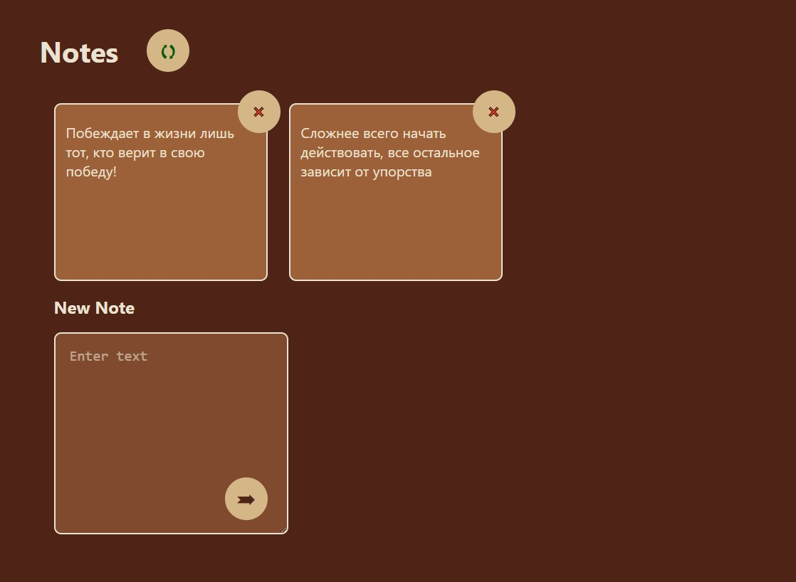

# CRUD

Учебный проект курса [React для JS-разработчиков](https://netology.ru/programs/react)

## **Задача**

Реализовать базовый CRUD без обновления при работе с HTTP.

Backend проекта можно найти по [ссылке](https://github.com/alekseeva-t-v/crud-backend).

## **Описание проекта**

***Первоначальная загрузка***:  

Делается http-запрос `GET` на адрес http://localhost:7070/notes, полученные данные отображаются в виде карточек с возможностью удаления.

***Добавление***:

При заполнении формы и нажатии кнопки «Добавить».
Выполняется http-запрос `POST` на адрес http://localhost:7070/notes, в теле запроса передаётся следующий JSON:
```JavaScript
{
    "id": 0,
    "content": "То, что было введено в поле ввода"
}
```
После чего делается запрос на получение всех записей и происходит обновление списка — `GET` http://localhost:7070/notes.

***Удаление***:

При нажатии на крестик на одной из карточек.
Выполняется http-запрос `DELETE` на адрес http://localhost:7070/notes/{id}, где `id` — это идентификатор заметки.
После чего делается запрос на получение всех записей и происходит обновление списка — `GET` http://localhost:7070/notes.

***Обновление***:

При нажатии на кнопку «Обновить» — две зелёные стрелочки.
После чего делается запрос на получение всех записей и происходит обновление списка — `GET` http://localhost:7070/notes.

## **Стек технологий**


## [**Демо**](https://crud-frontend-tau.vercel.app/)
(работает в случае, если запущен Backend)


